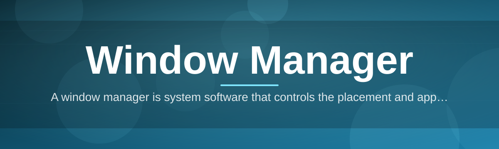
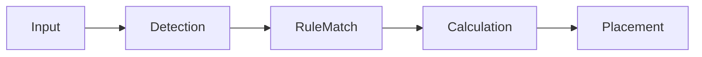

# window-manager-controller 🪟⚡

  

*Your windows, finally behaving like adults — snap, tile, and tame every workspace without lifting a mouse finger more than once.*

## 🧭 Overview

**TL;DR: This is a window manager for people who are done fighting their own desktop.**

Let's get something straight: your operating system's default window handling was designed for a world where people had one monitor and infinite patience. `window-manager-controller` exists because neither of those things is true anymore. This is a lightweight, standalone controller that sits on top of your existing windowing system and takes over the boring, repetitive part of desktop management — placement, sizing, snapping, and keeping your sanity intact when you've got twelve apps open across three monitors.

A window manager, in the classic sense, is the piece of system software responsible for how windows look, where they sit, and how they behave inside your graphical environment. It doesn't replace your OS — it collaborates with the graphics stack, your input devices, and the desktop shell to make the whole experience feel intentional instead of accidental. Most window managers quietly power the desktop environment you already know; this one just does it better, faster, and with an opinion about how your screen real estate *should* be used.

This tool is for the tiling enthusiasts, the multi-monitor power users, the developers who tab through fifteen terminal windows a day, and the mildly-obsessive people who rearrange their desktop the second something looks off-center. If you've ever manually dragged a window to the exact same spot for the hundredth time, this repository was built with you specifically in mind.

## 📥 Get It

  

---

## 🌟 What This Thing Actually Does

**TL;DR: Smart snapping first, everything else is icing on a very well-organized cake.**

> [!NOTE]
> The list below is ordered by "wow factor," not alphabet. We're proud of some features more than others, and we're not going to pretend otherwise.

- **Predictive Smart Snapping** — Drag a window near an edge and it doesn't just snap, it *anticipates* where you're trying to put it based on your screen layout. Feels less like software and more like it's reading your mind, minus the creepy part.

- **Zone-Based Tiling Engine** — Define custom zones once, and every window you throw at your desktop obediently lands where it belongs. No more manual resizing rituals every Monday morning.

- **Multi-Monitor Memory** — Unplug a monitor, plug it back in later, and your windows return to their exact previous positions. It remembers your setup better than you remember where you put your keys.

- **Keyboard-First Window Control** — Every action has a shortcut. Mouse dragging becomes optional, not mandatory, for people who live in their keyboard.

- **Instant Window Cycling** — Alt-tab, but if it actually understood which window you meant instead of guessing.

- **Custom Layout Profiles** — Save layouts for "coding," "meeting," or "everything is on fire" mode and switch between them in a click.

- **Low-Footprint Background Process** — Runs quietly, uses almost nothing, and doesn't turn your task manager into a horror show.

- **Theming & Border Styling** — Because a functional desktop doesn't have to look like a spreadsheet from 2004.

## 🚀 Getting Started

**TL;DR: Download it, run it, and stop thinking about window placement ever again.**

1. Head to the landing page and grab the latest build using the download button above.

2. Run the installer — no dependencies, no extra runtime downloads, no drama.

3. Launch `window-manager-controller` once and let it detect your current monitor setup automatically.

4. Open the settings panel, pick a layout profile (or build your own), and get back to actually working.

> [!TIP]
> Run it once, then forget it exists. That's the whole point — this is a "set it and let it quietly run in the background" kind of tool, not something you babysit.

## 💻 System Requirements

**TL;DR: If you're on Windows 10 or 11, you're already good to go.**

| Requirement | Details |
|---|---|
| OS | Windows 10 (1809+) or Windows 11 |
| Architecture | x64 |
| RAM | 4 GB minimum, 8 GB comfortable |
| Disk Space | Under 50 MB — this isn't bloatware |
| Dependencies | None. Fully standalone. |
| Internet | Only needed to download it once |

> [!IMPORTANT]
> This is a standalone Windows application. No background frameworks, no hidden dependency chains, no "please also install this other thing first."

## ⚙️ How It Works

**TL;DR: It watches your windows, decides where they should go, and moves them — fast.**

Under the hood, `window-manager-controller` behaves like a lightweight negotiator between your input devices and the graphics layer your OS already provides. It hooks into window events, checks them against your active layout rules, and repositions things before you even notice a delay.

1. **Detection** — The controller listens for window creation, movement, and focus events.
2. **Rule Matching** — Each event is checked against your active zone or layout profile.
3. **Calculation** — Target coordinates and dimensions are computed instantly.
4. **Execution** — The window is moved/resized using native windowing calls.
5. **Feedback Loop** — Your next drag or shortcut refines the behavior further.

<strong>Curious about the technical guts?</strong>

The controller uses native Windows APIs for window enumeration and positioning, avoiding third-party rendering layers entirely. This keeps latency low and compatibility high across different graphics hardware setups — because a window manager that lags is just a worse version of doing it manually.

## 🩹 Troubleshooting

**TL;DR: Most issues are one toggle away from being fixed.**

**Q: My windows snap to the wrong zone.**
A: Your zone layout probably needs recalibrating after a resolution change — open Settings > Layout and hit "Re-detect Monitors."

**Q: Keyboard shortcuts aren't responding.**
A: Another app is likely intercepting the same hotkey combo. Check the Shortcuts tab for conflicts.

**Q: A window won't move at all.**
A: Some elevated/admin apps block external positioning calls. Run the controller as administrator for those specific windows.

**Q: My multi-monitor layout didn't restore properly.**
A: This usually happens when a monitor is detected in a different order than before — give it a few seconds, it self-corrects on the next display refresh.

**Q: The app feels invisible — is it even running?**
A: That's intentional. Check the system tray icon; it's meant to be a background operator, not a spotlight hog.

## 🎨 UI / UX Details

**TL;DR: Minimal by default, deeply customizable if you want to dig in.**

- **Themes:** Light, Dark, and an auto-switch based on system theme.
- **Border Styling:** Adjustable accent colors and thickness for active/inactive windows.
- **Settings Panel:** Clean tabbed interface — Layouts, Shortcuts, Monitors, Appearance.

<strong>Default Keyboard Shortcuts</strong>

| Action | Shortcut |
|---|---|
| Snap window left | `Win + Alt + ←` |
| Snap window right | `Win + Alt + →` |
| Cycle layouts | `Win + Alt + L` |
| Toggle tiling mode | `Win + Alt + T` |
| Focus next window | `Win + Alt + Tab` |

> [!WARNING]
> Some shortcuts may overlap with existing OS-level bindings. Review the Shortcuts tab after your first launch to avoid double-triggers.

## 🤝 Contributing & Community

**TL;DR: Bug reports, ideas, and layout templates are all welcome.**

This project grows because people actually use it and tell us what's broken or missing. Open an issue if something behaves oddly, or share a layout profile you've built — some of the best defaults started as community submissions.

> [!NOTE]
> Pull requests should include a clear description of the behavior change. "It felt better" is a great instinct but a rough changelog entry.

 

## 📄 License

**TL;DR: MIT. Use it, modify it, just don't blame us if you re-tile your desktop at 3 AM.**

Released under the [MIT License](LICENSE), 2026.

## ⚠️ Disclaimer

**TL;DR: This tool changes window behavior — use good judgment with critical workflows.**

`window-manager-controller` modifies how windows are positioned and displayed on your system. While built for stability, no window management tool is immune to edge cases across the wide variety of Windows configurations out there. Use it thoughtfully, keep your system updated, and back up critical workflows as you would with any desktop utility.

---

  

